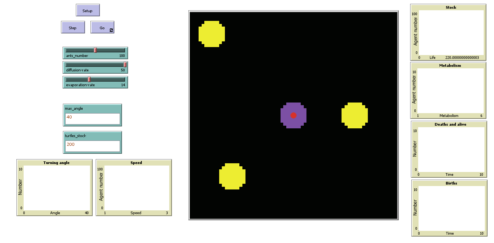

# Ants-evolution-model
NetLogo model to simulate and analyze an environment where ants adapt and evolve.  
It has been realised in NetLogo 6.3.0.  


## Table of Contents
1. [Description](#Description)  
   1.1 [Environment](#Environment)  
   1.2 [Agents](#Agents)  
   1.3 [System dynamics](#System-dynamics)  
2. [Usage](#Usage)  
   2.1 [Model interface](#Model-interface)  
   2.2 [Simulation example](#Simulation-example)  
4. [Installation](#Installation)  
5. [Credits](#Credits)  


<a name="Description"></a>
## Description
The system depicts a multi-agent model in which the various elements are able to evolve and adapt to the environment. The process of evolution is carried out using genetic algorithms. The mechanism of "Swarm intelligence" emerges, characterized by the presence of feedback (pheromone trails) and stochastic elements.  

### Environment <a name="Environment"></a>
The environment is formed by a two-dimensional grid of patches of pre-established dimensions.  
Some patches play a special role.  
- Nest patch: the ants' nest is the place were the food is brought, it is also the starting point for the agents.
- Food patch: this kind of patch represents the nourishment source, there are three food sources in total and every 70 steps one source is replenished.
- Pheromone patch: when they pick up food, agents release a certain amount of pheromone in the environment. In this way other agents, attracted by the pheromone trail, approach the food source. Over time, the quantity of pheromone present on a patch evaporates.

In order to trigger the natural selection and the mechanism of evolution of the species, the environment applies a selective pressure on the agents.  
Properties of the breed (from the source code):
```
patches-own
[
  pheromone            ;; quantity of pheromone in the patch
  food                 ;; presence of food in the patch (0, 1)
  nest?                ;; true if the patch is part of the nest, false otherwise
  nestSmell            ;; the higher it is, the closer you are to the nest
]
```

### Agents <a name="Agents"></a>
The agents are represented by the ants, each ant has a set of behaviors that allow interaction with the environment and with other agents. 
Properties of the breed (from the source code):
```
turtles-own
[
  turning_angle        ;; turning angle
  speed                ;; number of steps of roam {1, 2}
  stock                ;; must be > 0 to survive
  threshold_stock      ;; minimum "wealth" for having children
  age                  ;; age counter, it's zero for newborns
  metabolism           ;; it's subtracted from stock {1, 2, 3, 4, 5}
]
```
Every step, the age increase and the ant's stock is decreased by a value equal to the metabolism.  

### System dynamics <a name="System-dynamics"></a>
The behavior of the agents is detailed below.  
- search food: An ant in the "empty" state (red) is searching for food in the environment. It explores the surrounding patches following the pheromone trail, during this search if the ant finds food it changes its status to "full" (orange) and pick up some.
- return to nest: An ant in the "full" state (orange) is returning to the nest in order to drop off the food. While it is carrying the food it release pheromone. Whenever an agent deposit some food in the nest, its stock is replenished. Every agent return to the nest following the nest smell.
- death (selective pressure): If the stock of the ant is less than or equal to zero the ant die.
- reproduction: In the event that an agent is carrying food, an age greater than 30, and has got a stock that exceeds a fixed threshold, the agent in question is eligible for reproduction. In the event that there is another agent who meets the same age and stock requirements, the two agents can proceed with the reproduction. In this way, from the recombination of the two ants' genes (crossover) a new agent is obtained. The newborn ant joins the system and then begins the search for food. With each birth, the parental stock is decreased by a tenth.

The system's capacity to adapt to the environment causes new generations of individuals to have the most environmentally adapted genes. This leads to a stable equilibrium situation.


<a name="Usage"></a>
## Usage 
### Model interface <a name="Model-interface"></a>


Any parameter may be modified using the sliders and input boxes. In addition, there are some diagrams that help keeping track of all the aspects of the system.  
Control buttons:
- Setup &#8594; sets up the angents, environment and global variables.
- Step &#8594; runs one step of the simulation.
- Go &#8594; runs the simulation endlessly, it can be stopped if pressed again.

### Simulation example <a name="Simulation-example"></a>
Video of a simulation example: [Here](Footage/Ants-evolution-video.mp4).  

#### Observation on the final simulation 
The system has adapted to the environment and evolved. The agents with metabolism 1 and speed 2 are the ones most likely to survive, and all new generations will inherit these characteristics. It can be said that the system is in a state of stable equilibrium in the phase space. From the initial state, information has been lost. Ants with speed other than 2 and metabolism other than 1 can no longer exist.   
In conclusion, by using only the crossover technique during reproduction, no alternative solutions are ever explored (as would be in the case of introduction of punctual mutation). Accordingly, as time passes, the agents that survive are only those with the appropriate characteristics, new generations then inherit only those.


## Installation <a name="Installation"></a>
Open the file *Ants evolution.nlogo*, it is necessary having installed NetLogo.


## Credits <a name="Credits"></a>
*Learning and evolution of artificial systems* lectures of the computer science course at UniMoRe.
